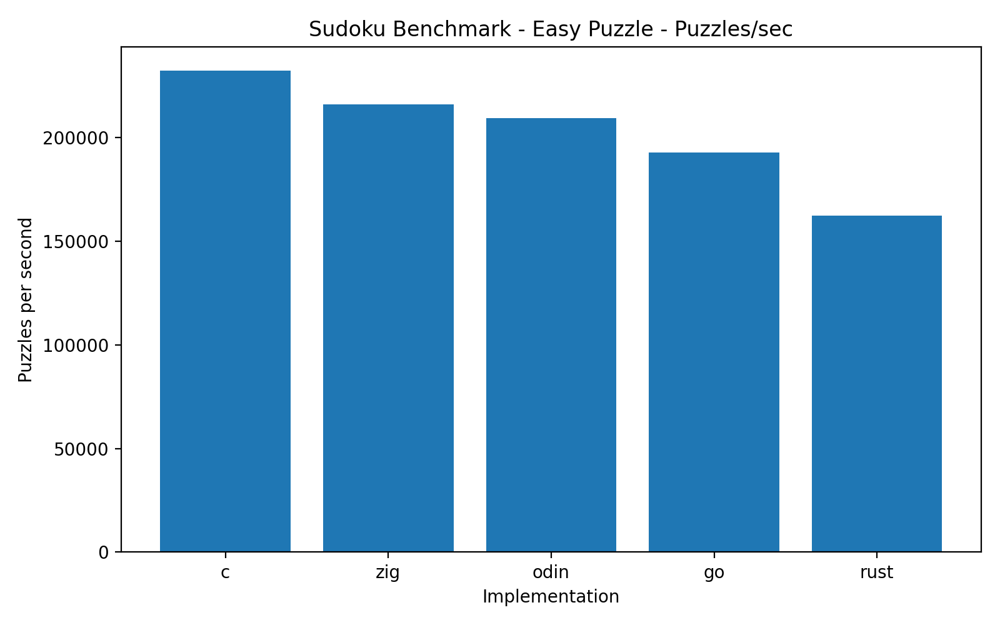
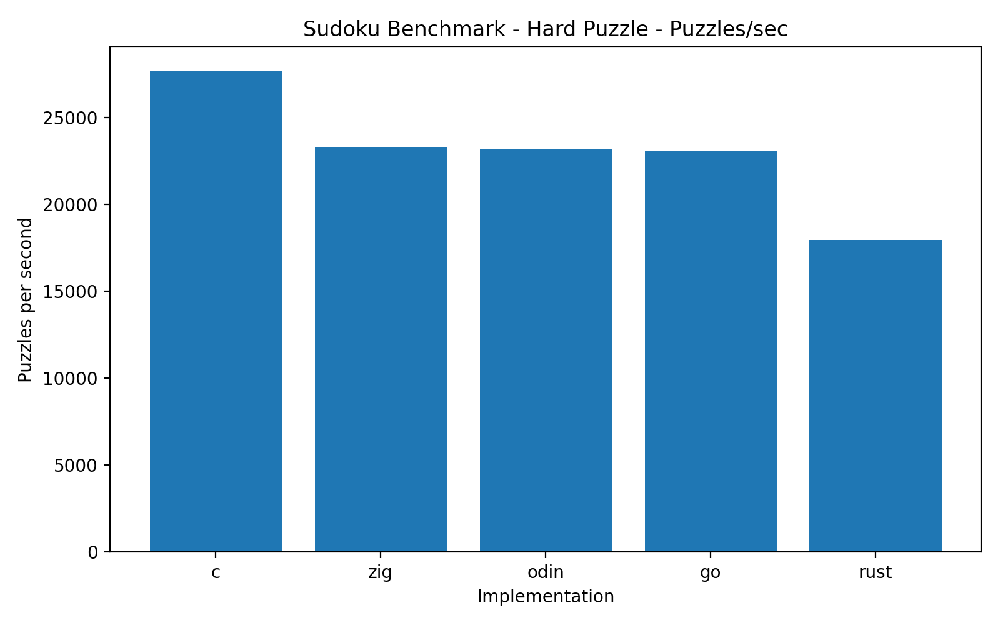

# How do I feel about these C alternatives?

[Github Repo](https://github.com/grsouth/sudoku_solvers)

## C Alternatives

The main purpose of this project is to compare several different languages that are often billed as alternatives to C. 

I first learned to program in C and C++, so I have a certain fondness for the language that might make it hard for me to be objective about its rough edges. I want to see how the alternatives stack up in terms of both ease of development and performance.

The languages I want to compare are:
- C
- Rust
- Go
- Zig
- Odin

This is by no means an exhaustive list of C alternatives, but I think it covers a good range of the most popular ones that I hear talked about.

To do a quick and dirty benchmark, I'll implement the same sudoku puzzle solver in each language. That'll give me a taste both for the development experience and the performance characteristics of each language.

## Puzzle Format

Puzzle files live in the `puzzles/` directory. Each puzzle is stored as a single line of 81 characters, using the digits 1 through 9 for filled cells and `0` for empty cells.

For example:

```text
530070000600195000098000060800060003400803001700020006060000280000419005000080079
```

Corresponds to:
```text
5 3 - | 7 - - | - - -
6 - - | 1 9 5 | - - -
- 9 8 | - - - | - 6 -
------+-------+------
8 - - | - 6 - | - - 3
4 - - | 8 - 3 | - - 1
7 - - | - 2 - | - - 6
------+-------+------
- 6 - | - - - | 2 8 -
- - - | 4 1 9 | - - 5
- - - | - 8 - | - 7 9
```

## Algorithm

I want to keep the core algorithm simple and repeatable. The easiest way to write a sudoku solver is a recursive algorithm that, for each empty square, selects a legal number and continues to the next empty square. Of course, a number can be legal in the current position and still not actually be part of the final solution. When the recursive chain hits a dead end, it'll 'return false' back upwards to try a different legal number in that square, and continue again from there.
This is basically just a special depth-first search

```text
solve():
    find an empty cell
    if none exists:
        return true

    get available digits for that cell

    for each available digit:
        place digit
        if solve():
            return true
        undo digit

    return false
```

### Notes on the Algorithm

#### Algorithm X and Dancing Links

I want to briefly acknowledge that this is not actually the best way to solve a Sudoku puzzle.

Sudoku is an example of what a mathematician would call an 'exact cover problem'. Many papers have been written on this subject. A very clever (but much more complex) way to solve a problem like this is to use Knuth's "Algorithm X", and implement it using the "Dancing Links" technique. This would involve using doubly linked list to represent all of the constraints.

If I were building this for a production setting where raw performance mattered, I'd try to do it this way. For the sake of the simplicity of this project though, I'll stick to the more straightforward approach.

#### "find an empty cell"

The most naive way to do this would just be to traverse the board from top to bottom, left to right, looking for empty cells. I want to be a little smarter than that. A good heuristic is to instead find the cell with the *fewest legal digits* allowed. Choosing that cell first will reduce the amount of backtracking we have to do.

The easiest way to implement this is to just scan the board and count the legal digits for each empty cell, keeping track of the one with the fewest. It adds the overhead of scanning the board on each recursive call, but since the size of the board is fixed at 9x9, and the potential time saved by reducing backtracking is much greater, it's almost certainly worth it in practice.

#### "get available digits for that cell"

A slightly smarter way to approach this is to use bitmasking.

Instead of repeatedly scanning the board every time we want to check legality, we can maintain a collection of integers, where each bit represents whether a digit is present in that row, column, or box. This allows us to quickly compute the legal digits for a cell using bitwise operations.

For example, if a row already contains 1, 4, and 7, its mask could be:

```text
001001001
```

To find the legal digits for a cell, we do an OR operation on the row, column, and box masks, then invert the result and keep only the lowest 9 bits:

```text
NINE_BIT_MASK = 0x1FF
used = row_mask[r] | col_mask[c] | box_mask[b]
available = NINE_BIT_MASK & ~used
```

# Speed Results

To quickly benchmark the performance of each implementation, I ran each solver on two different puzzles, one easy and one hard. (The hard puzzle has fewer clues, which means the solver has to do more backtracking). Each solver ran the same puzzle a million times.




| Language | avg ms/run | puzzles/sec | wall sec |
|----------|-----------:|------------:|---------:|
| C        | 0.004304   | 232,342     | 4.304    |
| Zig      | 0.004626   | 216,169     | 4.627    |
| Odin     | 0.004776   | 209,380     | 4.777    |
| Go       | 0.005186   | 192,827     | 5.187    |
| Rust     | 0.006161   | 162,311     | 6.162    |




| Language | avg ms/run | puzzles/sec | wall sec |
|----------|-----------:|------------:|---------:|
| C        | 0.036103   | 27,699      | 36.104   |
| Zig      | 0.042886   | 23,318      | 42.886   |
| Odin     | 0.043144   | 23,178      | 43.146   |
| Go       | 0.043328   | 23,080      | 43.330   |
| Rust     | 0.055663   | 17,965      | 55.664   |

As expected, C is unmatched in raw performance. Zig and Odin are pretty comparable to each other, coming in just behind C. Go is a little slower still and Rust (surprisingly to me) is the slowest of the bunch.

Roughly speaking, averaging across the puzzles:
- Zig is about 13% slower than C
- Odin is about 15% slower than C
- Go is about 20% slower than C
- Rust is about 49% slower than C

The performance gap between C and the others is more dramatic on the harder puzzle. The fact that C does even better when the solver does more backtracking suggests to me that there is better optimization of the loops and bit operations, and/or less recursion overhead. I'd like to know more about how gcc optimizes C code.

The fact that Zig and Odin are close to C is generally what I expected, as this aligns with their stated design goals. What's surprising to me is that Go outperformed Rust, which doesn't match up with what I knew about the languages. For example, I know that Go runs on a garbage collected runtime, which I would have expected to add a hit compared to Rust's zero-cost memory safety.

I don't have a good explanation for this, and not to be too much of a Rust apologist, but I have a few theories:

1. My Rust implementation might not be as optimized as it could be. I'm a beginner when it comes to writing and understanding Rust code, so it's possible that I wrote inefficient code without realizing it.

2. The Rust compiler might not be optimizing the code as well as the Go compiler in this particular case. It's possible that there are some build settings or flags that I could be using to improve the performance of the Rust code.

In any case, I don't want to jump to any conclusions and claim something like "Rust is slower than Go actually".

# Development Experience and Language Quirks

## C

The old tried and true. C is a language that I still have a lot of love for, despite its age and some of its rough edges. Have I simply been stockholm-syndromed by my early exposure to it? Maybe. Better the devil you know?

It seems to me like, at least in this very limited example, C is still the king of raw performance. I didn't expect any other language implementation to beat it, and I was right.

This project was very simple, perhaps *too* simple for any of the scary parts of C to rear their heads. I didn't have to deal with any multithreading, or any very complex data structures. I didn't really use any dynamic memory allocation, and my opportunities to shoot myself in the foot were pretty limited.

## Zig

Zig is interesting. With Odin it mostly delivered on the promise of being "almost as fast as C".

The syntax is a bit more verbose and felt quirky, for example, with its use of "@" builtins. In theory I can understand why there is so much explicitness around types and conversions, but I suppose I wasn't used to it. Maybe that's friction in a good way?

It feels more modern in the sense that it's guiding me more towards a certain style, instead of just writing a series of statements. See the enforced "try" syntax for error handling, etc.

## Odin

Compared to Zig, Odin feels like more "natural" code. It feels a bit less verbose, and a bit more aesthetically similar to the "simplicity" I liked from C. I like using the := operator for variable declaration (as with Go).

To me, this feels like a more natural "C replacement", whereas Zig feels more opinionated and explicit. I don't know if I have a firm answer on which one is "better" but I can understand why people prefer one to another. I think I personally prefer Odin to Zig.

## Go

It might be a little unfair to bill Go as a "C replacement", because I don't think that it's exactly claiming to be. Go definitely feels like more of a general purpose language with a lot of modern programming conveniences baked in. I think "batteries included" is the term.

It is liberating, if a little bit defeating, to relinquish control to the garbage collector. Not that that was a major factor in this particular project.

I really like the Go syntax, it's clean and straightforward. It feels understandable and easy to read in a c-like way, that's also definitely of the modern style. I can see why it's popular, I like it a lot.

I didn't really get to experience a lot of the things that Go is supposed to be good at, like easy concurrency with goroutines, and the rich standard library. I think the bigger the project is, the more I would like Go (and I already like it anyways.)

## Rust

Ah, Rust. It's the language people love to love and love to hate. I'll try not to step on any toes. I am very intrigued by Rust and the promises it makes about memory safety and performance.

Rust is, unsurprisingly, the most difficult to write of the bunch. Much has been said about the steep learning curve involved in writing things the "Rust way", and as a Rust novice, I definitely felt that. It can sometimes feel like you're fighting the compiler and you don't even know why. I know that the compiler knows why, but I still don't.

If given the chance, I can see myself investing the time to learn Rust more deeply. I can see how immersing yourself in the memory-safe paradigm could eventually become second nature, and it could result in me naturally writing more reliable code. Maybe someday I'll get there. I don't want to give up on Rust.

# Conclusion

This was a fun way to get a taste of some languages that I've heard about, but barely played with. Given the limited scope of my little sudoku solver, I don't think it would be fair to draw any sweeping conclusions---especially about the performance characteristics in such a limited context.

My love for C is still alive, but I do have an appreciation for the design goals of these other languages. I'm glad all of them exist. On a purely personal level, I was impressed by the code style of both Odin and Go, and they are the languages I am the most interested in going forward. Many of my feelings about Rust are still up in the air, as I think no one can really pass judgement on it without giving it more than a few hours of their time.
